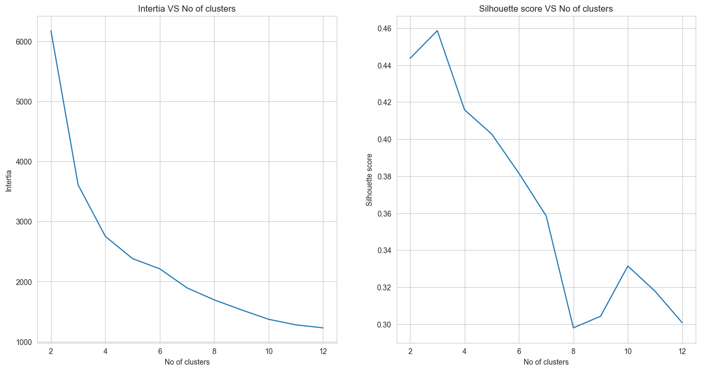
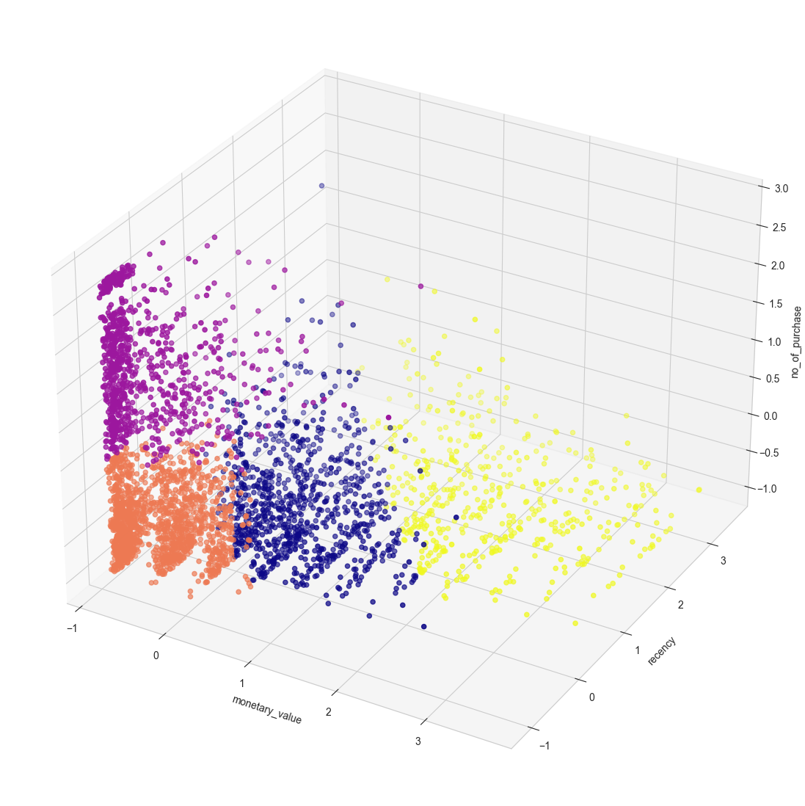
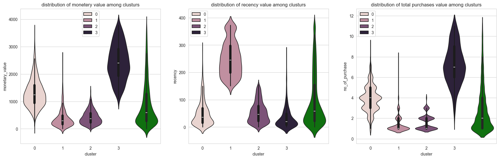
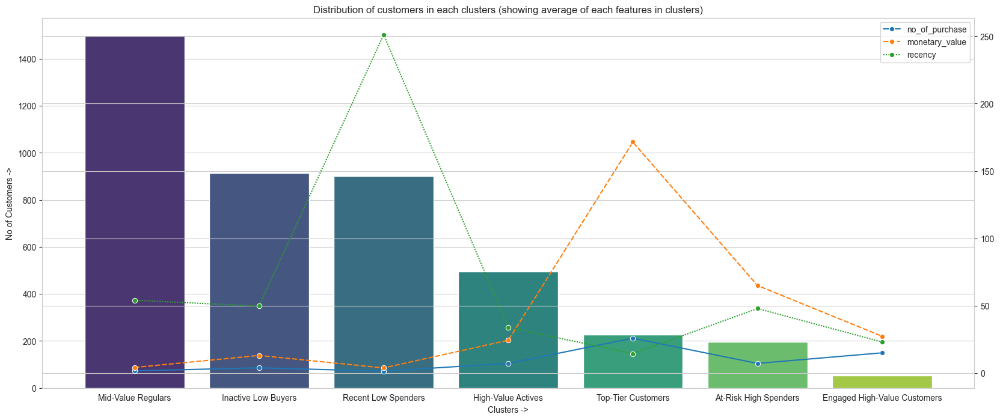

# Customer Segmentation using KMeans Clustering

## 📌 Project Overview

This project demonstrates an **industry-aligned data science workflow** applied to **real-world online retail data**. The goal is to understand customer behavior and derive actionable business insights through **unsupervised learning**, specifically **KMeans clustering**.

Rather than focusing only on model execution, this project emphasizes:

* Real-world data preprocessing challenges
* Feature engineering for meaningful representation
* Model selection using quantitative metrics
* Translating analytical results into business strategies

The final outcome is a **robust customer segmentation framework** that can directly support marketing, retention, and revenue optimization decisions.

(Check Notebook for better understanding)

---

## 🎯 Objectives

* Segment customers based on purchasing behavior
* Identify high-value, at-risk, and growth-potential customers
* Validate clustering quality using standard evaluation techniques
* Provide business-focused interpretations and recommendations

---

## 🗂 Dataset

* **Type:** Real-world online retail transaction data
* **Nature:** Noisy, imbalanced, and containing outliers (typical of production data)
* **Granularity:** Customer-level aggregated behavior

---

## 🛠 Feature Engineering

Following industry standards, raw transactional data was transformed into meaningful behavioral features:

* **Monetary Value** – Total amount spent by a customer
* **Recency** – How recently the customer made a purchase
* **Number of Purchases** – Purchase frequency

Additional processing steps:

* Aggregation from transaction-level to customer-level data
* Scaling and normalization for distance-based models
* Explicit outlier detection and separation for high-performing customers

This ensured **complete and effective utilization of the dataset**.

---

## 🔍 Exploratory Data Analysis (EDA)

EDA was performed to:

* Understand feature distributions
* Detect skewness and extreme values
* Observe linearity, correlation, and parallel behavior patterns

Visualizations used:

* Box plots
* Violin plots
* Scatter plots (2D & 3D)
* Line plots for model diagnostics

---

## 🤖 Modeling Approach

### KMeans Clustering

KMeans was selected due to its:

* Interpretability
* Scalability
* Practical use in customer analytics

### Optimal Cluster Selection

The number of clusters was selected using:

* **Elbow Method** (monitoring inertia)
* **Silhouette Score** (cluster separation and cohesion)

These metrics were used to ensure clustering quality and stability.
Both metrics were evaluated together to avoid underfitting or over-segmentation.

---

## 📊 Core Customer Clusters (After Outlier Removal)

### Cluster 0 – *Inactive Low Buyers*

**Profile:** Low monetary | Low recency | Low purchases

* Irregular and low-engagement customers
* Strategy: Reactivation campaigns, entry-level offers

### Cluster 1 – *Recent Low Spenders*

**Profile:** Low monetary | High recency | Low purchases

* Active but low-value customers
* Strategy: Upselling, spending-based incentives

### Cluster 2 – *Mid-Value Regulars*

**Profile:** Medium monetary | Medium–High recency | Medium purchases

* Strong retention potential
* Strategy: Loyalty programs, predictive reminders

### Cluster 3 – *High-Value Actives*

**Profile:** High monetary | High recency | High purchases

* Most valuable customer segment
* Strategy: VIP programs, early access, premium support

---

## 🚨 Outlier-Based High Performance Clustering

To avoid distortion of core clusters, high-performing customers were analyzed separately.

### Cluster -1 – *At-Risk High Spenders*

**Profile:** High monetary | Poor recency | Low purchases

* Previously valuable but disengaging
* Strategy: Churn diagnostics, personalized reactivation

### Cluster -2 – *Engaged High-Value Customers*

**Profile:** Good monetary | Good recency | High purchases

* Consistently active and valuable
* Strategy: Purchase rewards, smart recommendations

### Cluster -3 – *Top-Tier Customers*

**Profile:** Very high monetary | Very high recency | Very high purchases

* Highest revenue contributors
* Strategy: VIP exclusives, surprise rewards, premium experiences

---

## 🧠 Business Impact

This segmentation framework enables:
>   (Look at the notebook for better understanding)

* Targeted marketing strategies
* Improved customer retention
* Revenue optimization
* Churn risk identification
* Personalized customer experiences

The project bridges the gap between **data science execution** and **business decision-making**.

---

## 🧰 Tech Stack

* Python
* pandas, NumPy
* scikit-learn
* matplotlib, seaborn, plotly

---

## 🚀 Key Takeaways

* Demonstrates real-world data handling and feature engineering
* Applies unsupervised learning with proper validation
* Converts technical results into actionable insights
* Follows professional data science and analytics standards

---

## 📎 Author Notes

This project is designed to showcase **practical data science skills**, **analytical thinking**, and **business understanding**, making it suitable for portfolios, interviews, and real-world applications.